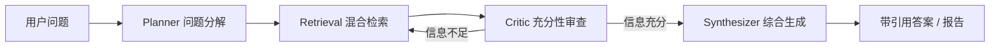
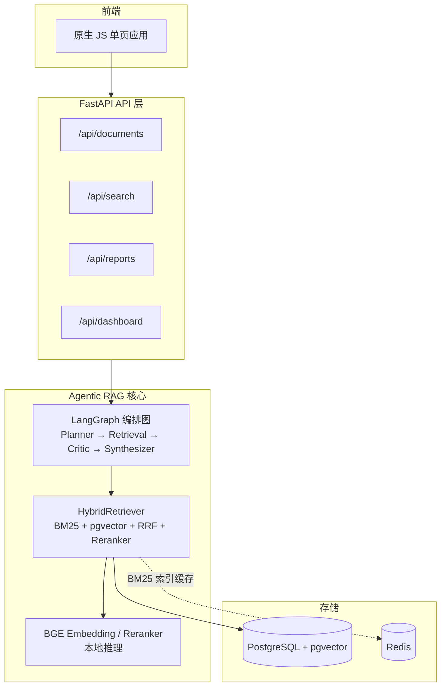

# Agentic RAG 企业智能搜索与自动调研系统

基于 **多步 Agentic 检索编排 + 混合检索（BM25 + 向量 + Reranker）+ 引用溯源** 的企业知识管理平台。上传文档后即可自然语言问答，并自动生成带引用的结构化调研报告。

> 技术栈：FastAPI · LangGraph · PostgreSQL + pgvector · Redis · BGE（本地 Embedding / Reranker）· DeepSeek LLM · 原生 JS 前端

## 核心亮点

- **多智能体 Agentic RAG**：LangGraph 编排 Planner → Retrieval → Critic → Synthesizer，信息不足自动补查、防死循环。
- **混合检索 + 查询增强**：BM25 + pgvector + RRF + BGE-Reranker；支持 LLM 查询改写 / HyDE，复杂查询 top-1 提升 9.09 个百分点。
- **可量化评测**：110 条评测集 × 402 分片知识库（合成 + 真实语料）四组消融——完整管线 top-1 74.55%、MRR 0.7889、nDCG@5 0.8026；RAGAS faithfulness 0.69。
- **工程闭环**：文档入库 → 多轮问答 → 调研报告（MD/PDF）→ 反馈看板；pytest 65 用例全绿，含检索性能基准与 BM25 增量索引。

---

## 1. 项目简介与核心特性

- **文档入库全链路**：上传 PDF / DOCX / MD / TXT / HTML → 解析 → 智能分片（标题 / 段落 / 长度三种策略）→ BGE 向量化 → 写入 pgvector（HNSW 索引）。
- **混合检索**：BM25 稀疏检索 + 向量稠密检索，RRF 融合排序，可选 BGE-Reranker 精排。
- **Agentic 多步问答**：Planner → Retrieval → Critic → Synthesizer 四智能体，Critic 判定信息充分性、不充分自动补查，防死循环上限保护。
- **SSE 流式回答**：逐 token 流式输出，前端实时呈现，并展示 Agent 流程（子查询 / 迭代轮次 / 耗时 / 置信度）。
- **自动调研报告**：给定主题，后台多轮检索后生成「背景 / 现状 / 技术方案 / 案例 / 趋势」结构化 Markdown 报告，支持下载 Markdown 或 **Chrome headless 导出 PDF**。
- **反馈闭环**：每次回答落库 query_log，用户可反馈「有帮助 / 没帮助」，运营看板展示热点问题与低置信度队列。
- **多轮对话**：问答请求可携带历史对话，支持「它 / 第二个方案」等指代消解；也可通过 `thread_id` + LangGraph checkpointer 由服务端跨请求恢复会话历史。

---

## 2. 架构说明

### 2.1 四模块（业务面）

| 模块 | 路由前缀 | 职责 |
|---|---|---|
| 文档管理 | `/api/documents` | 上传 / 批量导入 / 列表 / 详情 / 删除 |
| 搜索问答 | `/api/search` | 单轮检索、Agentic 问答、SSE 流式、反馈 |
| 调研报告 | `/api/reports` | 后台生成报告、列表、Markdown / PDF 下载 |
| 运营看板 | `/api/dashboard` | 统计、热点问题、低置信度队列、检索指标 |

### 2.2 四智能体（Agent 编排面）



| Agent | 职责 | 关键能力 |
|---|---|---|
| **Planner** | 把复杂问题拆成 2-5 个可独立检索的子查询 | 结合多轮历史做指代消解 |
| **Retrieval** | 对子查询执行混合检索（BM25 + 向量 + RRF + Reranker） | 返回带来源/分数的 chunk |
| **Critic** | 审查已检索信息是否足以回答问题 | 缺失方面 + 建议补充查询，迭代上限保护 |
| **Synthesizer** | 综合检索结果生成带 `[n]` 引用的最终答案 | 问答 / 报告 / 流式三种模式 |

### 2.3 整体架构



---

## 3. 技术栈清单

| 层 | 技术 |
|---|---|
| Web 框架 | FastAPI · Uvicorn · SSE（sse-starlette） |
| Agent 编排 | LangGraph · LangChain · langchain-openai |
| LLM | DeepSeek Chat（可替换任意 OpenAI 兼容 API） |
| 向量 / 检索 | PostgreSQL + pgvector · rank-bm25（Okapi BM25 倒排索引）· jieba（中文分词）· sentence-transformers（BGE） |
| 查询增强 | LLM 查询改写（rewrite）· HyDE 假设文档向量（默认关，可开关） |
| 会话持久化 | LangGraph checkpointer（内存默认，可切 Postgres） |
| 存储 | PostgreSQL（pgvector 镜像）· Redis |
| 文档解析 | pdfplumber · python-docx · BeautifulSoup · html2text |
| 报告导出 | python-markdown + Chrome headless（`--print-to-pdf`） |
| 评测 | pytest · ragas（LLM-as-judge 生成质量四指标） |
| 前端 | 原生 HTML / CSS / JS（无框架，含手写 SSE 客户端与 Markdown 渲染） |

---

## 4. 目录结构

```
agentic-rag-system/
├── backend/
│   ├── app/
│   │   ├── api/              # documents / search / report / dashboard 路由
│   │   ├── services/
│   │   │   ├── agents/       # planner / retrieval / critic / synthesizer / types
│   │   │   ├── ingestion.py  # 解析→分片→向量化→入库
│   │   │   ├── retriever.py  # 混合检索 + Reranker（增量 BM25 索引）
│   │   │   ├── query_enhance.py  # 查询改写 + HyDE
│   │   │   ├── chunker.py    # 多策略智能分片
│   │   │   ├── embedding.py  # BGE 向量化
│   │   │   └── parser.py     # 文档解析
│   │   ├── models/           # SQLAlchemy ORM（document / chunk / query_log / report）
│   │   ├── schemas/          # Pydantic 模型
│   │   ├── graph.py          # LangGraph 编排图 + 便捷执行函数
│   │   ├── config.py         # 配置（.env / 环境变量）
│   │   └── database.py       # 异步引擎 / 会话 / 建表建索引
│   ├── scripts/
│   │   ├── eval_data.py      # 合成 + 真实语料知识库 + 110 条评测集（统一数据源）
│   │   ├── eval_retrieval.py # 检索评测：四组消融 + 查询增强消融
│   │   ├── eval_tokenizer.py # 中文分词对比（jieba vs 字符滑动窗口）
│   │   ├── eval_ragas.py     # RAGAS 生成质量评测（faithfulness 等四指标）
│   │   └── benchmark_latency.py  # 检索延迟 / 吞吐 / 分阶段耗时 / 索引维护基准
│   ├── static/               # 前端 SPA
│   ├── tests/                # pytest 单测
│   └── output/               # 评测结果（eval_result.md / tokenizer_compare.md / ragas_result.md）
├── models/                   # 模型参考配置（权重在 HF 缓存）
├── scripts/                  # e2e 脚本、init-db.sql
├── docker-compose.yml        # PG + pgvector + Redis
├── requirements.txt
└── .env.example
```

---

## 5. 快速启动

### 5.1 启动依赖（PostgreSQL + pgvector + Redis）

```bash
docker compose up -d
```

首次启动会拉取 `pgvector/pgvector:pg16` 与 `redis:7-alpine`，并执行 `scripts/init-db.sql` 创建扩展。

### 5.2 配置环境变量

```bash
cp .env.example .env
# 编辑 .env：至少填 OPENAI_API_KEY；其余默认值即可本地跑通
```

> `.env` 可放在项目根目录或 `backend/` 下，`app/config.py` 会自动向上查找（优先 `backend/.env`）。

### 5.3 安装依赖

```bash
python -m venv .venv
# Windows:
.venv\Scripts\activate
# macOS / Linux:
source .venv/bin/activate

pip install -r requirements.txt
```

> 若本机连不上 huggingface.co，模型下载前先设置镜像：`export HF_ENDPOINT=https://hf-mirror.com`（Windows Git Bash）。首次运行会自动下载 BGE embedding / reranker 模型（约 1.5GB）。

### 5.4 启动服务

```bash
cd backend
python -m uvicorn app:app --port 8000
```

浏览器打开 <http://localhost:8000>（前端 SPA），API 前缀为 `/api`，健康检查 <http://localhost:8000/api/health>。

> 模型已缓存到本机时，可用离线模式避免联网：`HF_HUB_OFFLINE=1 TRANSFORMERS_OFFLINE=1 python -m uvicorn app:app --port 8000`。

---

## 6. API 一览表

| 方法 | 路径 | 说明 |
|---|---|---|
| GET | `/api/health` | 健康检查 |
| POST | `/api/documents/upload` | 上传单个文档并入库 |
| POST | `/api/documents/upload-batch` | 批量上传（部分失败不影响其他） |
| GET | `/api/documents` | 分页文档列表（`page` / `page_size` / `status`） |
| GET | `/api/documents/{id}` | 文档详情 |
| DELETE | `/api/documents/{id}` | 删除文档及分片 |
| GET | `/api/search` | 同步搜索（`q` / `top_k` / `use_agentic`） |
| POST | `/api/search/chat` | 问答（body 含 `question` / `top_k` / `use_agentic` / `history` / `thread_id`） |
| POST | `/api/search/chat/stream` | SSE 流式问答（同上 body） |
| POST | `/api/search/feedback` | 提交反馈（`query_log_id` / `feedback`） |
| POST | `/api/reports/generate` | 创建后台报告（`topic` / `depth`） |
| GET | `/api/reports` | 分页报告列表 |
| GET | `/api/reports/{id}/download` | 下载报告（`fmt=markdown` 或 `fmt=pdf`） |
| GET | `/api/dashboard/stats` | 知识库统计 |
| GET | `/api/dashboard/hot-queries` | 热点问题 |
| GET | `/api/dashboard/low-confidence` | 低置信度队列 |
| GET | `/api/dashboard/metrics` | 检索性能指标 |

---

## 7. Day 1-8 功能清单

| 阶段 | 交付内容 |
|---|---|
| **Day 1** | 文档入库全链路（解析 / 分片 / 向量化 / pgvector）、混合检索（BM25 + 向量 + RRF） |
| **Day 2** | Agentic 多步问答（Planner → Retrieval → Critic → Synthesizer，LangGraph 编排） |
| **Day 3** | 自动调研报告（后台生成 + 结构化 Markdown + 引用）、前端 SSE 流式回答 |
| **Day 4** | 反馈闭环（query_log + 反馈）、批量导入、Reranker 接入、检索评测脚本 |
| **Day 5** | Agent 流程可视化（前端四节点流程图实时高亮） |
| **Day 6** | 检索评测集加难例 + nDCG@5、报告 PDF 导出（Chrome headless）、README / 部署文档、多轮对话（chat history） |
| **Day 7** | 评测集 + 知识库扩量（300-500 chunks / 100+ 条）、四组消融实验、BM25 中文分词升级（jieba + 停用词）、RAGAS 生成质量评测、LangGraph checkpointer 会话持久化 |
| **Day 8** | 查询增强（查询改写 + HyDE）、检索性能基准（延迟/吞吐/阶段耗时）、BM25 索引增量更新、真实公开语料混合 + RAGAS 样本扩到 40+ |

---

## 8. 部署说明

详细部署、模型缓存与环境变量说明见 **[docs/deploy.md](docs/deploy.md)**。要点：

- **Docker Compose 部署**：PG + pgvector + Redis 由 compose 编排，应用进程本地跑或自行容器化。
- **模型缓存**：BGE 模型缓存在 `~/.cache/huggingface/hub`，离线用 `HF_HUB_OFFLINE=1 TRANSFORMERS_OFFLINE=1`。
- **环境变量**：`.env` 覆盖默认值，系统环境变量优先级高于 `.env`。
